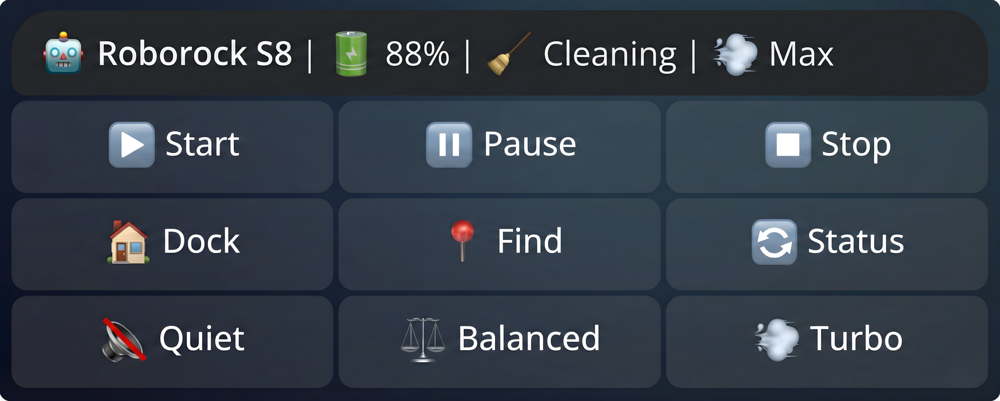

# openclaw-roborock-cli

[](https://github.com/MOZARTINOS/openclaw-roborock-cli/actions/workflows/ci.yml)
[](https://opensource.org/licenses/MIT)
[](https://www.python.org/downloads/)

OpenClaw Roborock CLI is a Python project that works in two modes:

- standalone CLI for Roborock cloud control
- OpenClaw-compatible agent skill backend

It is designed for people who want scriptable terminal control and agent automation without relying on the mobile app UI.

## Preview



## What This Project Does

- Auth setup via email verification (`setup`)
- Built-in Android ADB fallback (`adb-setup`)
- Multi-device support (`devices`, `-d/--device`)
- Core commands (`start`, `stop`, `pause`, `dock`, `find`)
- Status and maintenance (`status`, `consumables`, `clean_summary`)
- Room-aware cleaning (`rooms`, `clean <room...>`, `--repeat`)
- Raw command passthrough for advanced use (`raw`)
- Optional Telegram panel (`bot`) with room buttons
- Optional camera tools (`snapshot`, `record`, `stream`)

## OpenClaw Positioning

This repository is not the OpenClaw core itself.  
It is an OpenClaw-compatible Roborock skill backend that can also run standalone as a normal CLI.

Agent instruction file (used directly by agents): `SKILL.md`  
Developer integration overview: `docs/OPENCLAW_SKILL.md`

## Requirements

- Python `3.11+`
- Roborock account with at least one device
- For base setup: email verification code access
- For ADB fallback: Android phone + USB debugging + `adb`
- For Telegram bot: `pip install roborock-cloud-cli[telegram]`
- For camera commands: `pip install roborock-cloud-cli[camera]`

## Installation

Base package:

```bash
pip install roborock-cloud-cli
```

All optional features:

```bash
pip install roborock-cloud-cli[all]
```

From source:

```bash
git clone https://github.com/MOZARTINOS/openclaw-roborock-cli.git
cd openclaw-roborock-cli
pip install -e .[dev]
```

Download without Git:
1. Open `https://github.com/MOZARTINOS/openclaw-roborock-cli`
2. Click `Code` -> `Download ZIP`
3. Extract, open terminal in folder, run `pip install -e .`

## Quick Start

Standard setup:

```bash
roborock-cli setup
roborock-cli devices
roborock-cli status
```

Room workflow:

```bash
roborock-cli rooms
roborock-cli clean Kitchen
roborock-cli clean Kitchen "Living Room" --repeat 2
```

ADB fallback:

```bash
roborock-cli adb-setup --log-file roborock_log.txt --email you@example.com
```

JSON output mode:

```bash
roborock-cli --json health
roborock-cli --json status
roborock-cli --json rooms
roborock-cli --json clean Kitchen
```

## Camera (Beta)

Camera functions are for camera-equipped models only.

Disclaimer:
- Camera support is beta.
- Behavior may vary by model, firmware, and region.
- Upstream app/firmware updates may break this feature.

Community testing is welcome.  
When reporting issues, include model, firmware version, command used, and redacted logs.

Examples:

```bash
roborock-cli snapshot -o photo.jpg
roborock-cli record --duration 30 -o clip.mp4
roborock-cli stream --host 127.0.0.1 --port 8554
```

Camera guide: `docs/CAMERA.md`

## Command Reference

| Command | Description |
| --- | --- |
| `setup` | Interactive setup via email verification |
| `adb-setup` | Build config from Android ADB extraction |
| `health` | Preflight check for version/config/devices |
| `devices` | List configured devices |
| `rooms` | Discover and cache room segment mapping |
| `map [-o output.png]` | Fetch and save the current map as PNG |
| `clean <rooms...>` | Clean one or more rooms by name |
| `status` | Get current status |
| `start` | Start cleaning |
| `stop` | Stop cleaning |
| `pause` | Pause cleaning |
| `dock` | Return to dock |
| `find` | Trigger locate beep |
| `fan_quiet` | Set fan to quiet |
| `fan_balanced` | Set fan to balanced |
| `fan_turbo` | Set fan to turbo |
| `fan_max` | Set fan to max |
| `consumables` | Show consumable wear summary |
| `clean_summary` | Show cleaning history summary |
| `raw <method> [json]` | Send raw Roborock command |
| `bot` | Start Telegram bot control panel |
| `snapshot` | Camera snapshot (camera models) |
| `record` | Camera video recording (camera models) |
| `stream` | MJPEG stream server (camera models) |

Global flags:

- `-d, --device <index>`: choose device index
- `--json`: machine-readable output
- `-v, --verbose`: debug logging

## Security

- Never commit `config.json`, tokens, `local_key`, or raw ADB payloads.
- Keep camera/ADB logs redacted before sharing.
- Rotate credentials if they were exposed.
- Prefer local camera stream binding (`127.0.0.1`) unless LAN access is required.

Security policy: `SECURITY.md`

## Public Repo Hygiene

This repo is configured to ignore common sensitive artifacts:

- `config.json`, `.env`, `credentials.json`
- `roborock_log*.txt`, `roborock_extracted.json`, `roborock*.ab`
- local generated preview images

## Documentation

- `SKILL.md` - OpenClaw agent instruction file (machine-facing)
- `docs/OPENCLAW_SKILL.md` - integration overview for developers (human-facing)
- `docs/ADB_EXTRACTION.md` - Android ADB extraction flow
- `docs/CAMERA.md` - camera usage and limitations
- `docs/PROTOCOL.md` - protocol and architecture notes

## Development

```bash
pip install -e .[dev]
pytest
```

Community files:

- `CONTRIBUTING.md`
- `CODE_OF_CONDUCT.md`
- `.github/pull_request_template.md`

## Support

- Issues: `https://github.com/MOZARTINOS/openclaw-roborock-cli/issues`
- Discussions: `https://github.com/MOZARTINOS/openclaw-roborock-cli/discussions`
- Releases: `https://github.com/MOZARTINOS/openclaw-roborock-cli/releases`

## License

MIT. See `LICENSE`.
